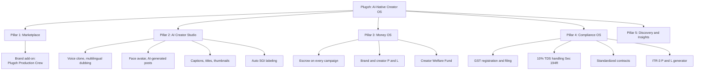

# Plugoh

**The AI-native operating system for India's creator economy.**

One platform. Brands find and book creators in minutes. Creators run their content, money, and compliance in one place. Built for the 50 million Indians who call themselves creators and the brands trying to reach them without burning a week on DMs and spreadsheets.

## Why Now

Three forces just collided in India.

**A creator economy that finally has scale.** India's creator economy is a $15B market in 2026, growing to $61.87B by 2033 at a 22.4% CAGR. Influencer marketing alone goes from ₹3,500 crore in 2026 to ₹10,750 crore by 2027. There are over 50 million people creating content. Only 2 to 3 million monetize meaningfully. 90% earn under ₹18,000 a month. The opportunity is not "more creators." The opportunity is "make the existing creators 10x more valuable."

**A regulatory deadline that nobody has built for.** The National Creator Economy Bill 2026, passed by the Rajya Sabha on April 14, 2026, makes content creators licensed professionals under Indian law. It introduces mandatory creator registration, standardized brand contracts, GST registration above ₹20L turnover, 10% TDS on perks above ₹20K under Section 194R, mandatory "Synthetically Generated Information" labeling for AI content, and a Creator Welfare Fund for health insurance and pension. None of the existing influencer marketplaces or content tools are shipping for this. We are.

**AI that's finally production-ready for creators.** Voice cloning, face avatars, and multilingual dubbing crossed the quality bar in 2025. The market is HeyGen + ElevenLabs at $50 to $100 per month, USD-priced, English-first. Indian creators speak Hindi, Tamil, Telugu, Kannada, Bengali, Marathi, Punjabi, Gujarati, Malayalam. They earn in rupees. They need an AI studio that costs ₹499 a month, not $79.

Plugoh is what happens when you build for all three at once.

## The Plugoh Operating System



Five pillars. One product. Built so a creator never has to leave Plugoh, and a brand never has to open another tool.

## Pillar 1: The Marketplace

Brands and creators find each other and close the deal here.

- Discovery with filters that matter in India: region, language, category, audience size, engagement quality, price band, content format, turnaround time.
- Brand workflow: post a brief or skip the brief and search by signal. Get matched. Book. Pay. Track.
- Creator workflow: inbound deals, every detail visible up front, accept or decline in one tap.
- Verified profiles, audience authenticity scoring, and fraud signals so brands stop paying for bot followers.
- Long-term retainer flows and performance-linked contracts, the formats brands actually want in 2026.
- **Plugoh Production Crew (brand add-on).** Some campaigns need more than the creator with their phone. Brands can add a Plugoh-dispatched video team to shoot alongside the creator on the day. Lighting, camera op, edit, deliverable. Top-up SKU, priced per shoot day. Higher quality at a fraction of an agency budget.

## Pillar 2: AI Creator Studio

The studio that lives inside the platform that already pays the creator.

- **Voice Clone.** Register your voice once. Type a script. Get studio-quality audio in your own voice, in any of Hindi, Tamil, Telugu, Kannada, Bengali, Marathi, Punjabi, Gujarati, Malayalam, and English. Dub a single video into ten regional cuts overnight. No re-recording. No hiring voice artists.
- **Face Avatar.** Register your face once. Generate photorealistic posts of yourself for any brand campaign. Skincare campaign with you holding the cream. Lifestyle post on a rooftop you have never been to. Brand integration without re-shooting. The creator's likeness, fully under their control, with consent and revocation built in.
- **AI Video Composer.** Title cards, captions in any Indian language, thumbnails, B-roll suggestions, transitions, music. The piece between "I have a clip" and "this is publishable."
- **Multilingual Repurposing.** One shoot becomes eight regional videos overnight, each with your voice, your captions, and your face. The fastest way for an Indian creator to leave English-only money on the table behind.
- **AI Campaign Brief.** Brand types intent in one paragraph. Plugoh writes a structured brief: deliverables, tone, references, deadlines, deliverable format, do's and don'ts. The brand reviews and sends.
- **AI Rate Suggestion.** Suggested rates for every campaign based on niche, region, follower band, engagement, season, and recent comparable deals on Plugoh. No more guessing. No more lowballing.
- **Auto-SGI Labeling.** Every artifact produced by the AI Studio is auto-tagged "Synthetically Generated Information" per the Creator Bill 2026. Compliance happens by default, not as an afterthought.

The studio uses best-in-class voice and avatar models under the hood, kept hypothetical at this stage so we can pick the providers that work best for Indian languages and Indian faces.

## Pillar 3: Money OS

Where the money actually moves.

- Escrow on every booking. Brand pays in. Creator gets paid only after delivery is approved. No more chasing.
- Real-time creator P and L: earnings by brand, by month, by campaign type, by package. Pending vs released vs withheld for tax.
- Real-time brand spend dashboard: by creator, by region, by language, by campaign ROI.
- Instant payouts after delivery approval. Direct UPI or bank transfer.
- Creator Welfare Fund auto-enrollment. The bill created the fund. Plugoh handles the registration so creators get health insurance, pension, and emergency support without paperwork.
- Tax-aware payment notes on every payout: TDS deducted, GST applicable, net to creator. The numbers a CA actually needs.

## Pillar 4: Compliance OS

The single hardest thing for an Indian creator. Solved by default.

- Creator Bill 2026 registration assist for high-earning creators required to register.
- Standardized brand contracts mandated by the bill, with the AI disclosure clauses pre-included.
- 18% GST registration support and quarterly filing for creators above ₹20L turnover.
- Section 194R 10% TDS handling on perks above ₹20K, automated for both brand and creator.
- Barter and perquisite tracking, including fair-market-value tagging on gifted products. The pain point every Indian creator's CA complains about.
- ITR-3 P and L generator from your campaign records. End of financial year takes hours, not weeks.
- SGI labeling automation across every AI artifact and contract clause.

A creator earning ₹5L in a year on Plugoh should be able to file their taxes without ever opening an Excel sheet.

## Pillar 5: Discovery and Insights

Because the cost of a bad collaboration is way higher than the price of one.

- Audience authenticity scoring. Real followers vs bots, engagement quality, comment sentiment.
- Performance prediction. Estimated views, saves, sends, and conversions before the campaign ships.
- Creator collab matching. Find creators to co-create with so audiences cross-promote naturally.
- Plugoh Verified badge. A trust signal a brand can actually rely on.
- Brand-side: campaign attribution dashboards that connect a reel to a click to a sale, the gap that breaks every other India platform.

## Pricing and Unit Economics

Built for Indian wallets. Built for Indian unit economics.

| Tier         | Audience                  | Price          | Includes                                                                                              |
| ------------ | ------------------------- | -------------- | ----------------------------------------------------------------------------------------------------- |
| Creator Free | First-time creators       | ₹0             | Marketplace, basic earnings dashboard, 5 AI credits / month                                           |
| Creator Pro  | Working creators          | ₹499 / month   | Unlimited campaigns, full AI Studio (voice, face, video), tax assist, ITR generator, priority payouts |
| Brand Free   | Trying it out             | ₹0             | Discovery, 1 active campaign                                                                          |
| Brand Growth | D2C and SMB               | ₹2,499 / month | Unlimited campaigns, advanced filters, performance analytics, basic Studio access                     |
| Brand Scale  | Mid-market and enterprise | ₹9,999 / month | Team seats, retainer flows, Production Crew priority, white-label brand pages, API access             |

- **Take rate:** 8% on creator payouts, well below India's 15 to 25% norm. First deal waived for both sides.
- **Production Crew:** ₹15,000 to ₹50,000 per shoot day, depending on tier and city.
- **AI credit packs:** ₹299 for 50 credits. One credit roughly equals a 60-second voice generation, an avatar still, or a minute of dubbing.
- **Brand outcome SKUs (rolling out):** performance-linked compensation where Plugoh shares risk and upside on conversion goals.

Numbers are launch pricing intent, calibrated to be sub-half of the cost of stitching HeyGen + Qoruz + ClearTax + Razorpay separately.

## Market and TAM

- India creator economy: **$15B in 2026**, projected **$61.87B by 2033** at **22.4% CAGR**.
- India influencer marketing: **₹3,500 crore in 2026**, projected **₹10,750 crore by 2027**, 20%+ CAGR.
- Addressable creators: **2 to 3 million monetizing today**, **50 million+** identifying as creators, **80 million+** posting content.
- Brand demand: **75% of Indian brands** allocate budget to influencer marketing.
- Regional content in Hindi, Tamil, Telugu, Bengali, Marathi, Punjabi, Gujarati, Kannada, and Malayalam is the fastest-growing slice. Tier 2 and Tier 3 cities now outperform metros on engagement.
- The wedge: nobody has bundled marketplace + AI tools + financial OS + Creator Bill compliance under one INR-priced product. We are first.

## Competitive Map

| Capability                           | Plugoh | Qoruz   | Kofluence | Chtrbox | HeyGen  | ClearTax |
| ------------------------------------ | ------ | ------- | --------- | ------- | ------- | -------- |
| Marketplace and discovery            | yes    | yes     | yes       | yes     | no      | no       |
| AI voice cloning                     | yes    | no      | no        | no      | yes     | no       |
| AI face avatar                       | yes    | no      | no        | no      | yes     | no       |
| Multilingual Indian-language dubbing | yes    | no      | no        | no      | partial | no       |
| Escrow and instant payouts           | yes    | partial | partial   | no      | no      | no       |
| GST + TDS + tax filing               | yes    | no      | no        | no      | no      | yes      |
| Creator Bill 2026 compliance         | yes    | no      | no        | no      | no      | partial  |
| Brand-side production crew add-on    | yes    | no      | no        | partial | no      | no       |
| INR-first pricing                    | yes    | yes     | yes       | yes     | no      | yes      |

Every cell is a wedge somebody else does not occupy. The "yes" column down Plugoh is the entire pitch.

## Roadmap

- **Live now (v1).** Marketplace, discovery, escrow-backed booking, campaign chat and delivery, earnings dashboard, AI profile text generation, Instagram connect, automated payment release.
- **Q3 2026.** AI Creator Studio v1: voice clone, multilingual dubbing, captions and titles, AI campaign brief, AI rate suggestion. Auto-SGI labeling shipped end-to-end.
- **Q4 2026.** Face Avatar generation. Compliance OS v1: GST registration, Section 194R TDS handling, standardized contracts, AI disclosure clauses, barter tracking.
- **Q1 2027.** Plugoh Production Crew SKU. ITR-3 P and L generator. Creator Welfare Fund auto-enrollment. Brand spend analytics v2.
- **Q2 2027.** Performance prediction model. Audience authenticity scoring. Creator collab matching. Brand white-label pages. Plugoh API for agencies.

## Why This Wins Y Combinator

- **Vertical AI as the workflow OS.** Matches the W26 thesis: AI is the operating system, not a feature. Workflow ownership in a vertical is the moat.
- **Time-bound regulatory wedge.** The Creator Bill 2026 just made compliance mandatory for 80M+ creators. There is a hard window. Whoever ships the compliance OS first owns the relationship.
- **Bundle defensibility.** Marketplace alone gets undercut. AI tools alone get commoditized. The bundle compounds: every campaign on the marketplace generates data that improves the AI Studio that improves the rate suggestions that drive better matches that fund more campaigns.
- **India-first pricing and language.** The foreign players cannot serve a creator earning ₹18,000 a month with USD-priced English-only tools. Plugoh can.
- **Already shipped a v1.** This is not a deck. The marketplace is live. The escrow is live. The dashboard is live. We are building from a real product, not a Figma file.
- **Creator Welfare Fund integration as distribution.** Once the bill's welfare fund flows through Plugoh, the platform becomes the default identity layer for Indian creators. Identity is the foundation for every future creator product.

## Currently Live

The honest version of what's actually shipped today. Everything above is the destination. This is the starting line.

- Two roles: business and influencer.
- Influencer onboarding with Instagram connect, profile fields, package pricing for reels, posts, and stories.
- Brand onboarding with business profile and Instagram connect.
- Influencer discovery with filters by city, category, follower count, and price.
- Booking flow: brand picks a package, builds a brief, pays through Razorpay escrow.
- Campaign lifecycle: offer, accept or decline, in-app chat, delivery upload, brand review, payment release.
- Influencer earnings dashboard: total earned, pending, monthly chart, tier progression, transaction history.
- AI-assisted profile text generation for both creators and brands.
- Cron-driven automatic payment release after delivery approval window.
- Email notifications for delivery and call requests.

If you are reading this README on the YC application portal: the rest of the document is the 24-month plan. The bullets above are what you can log into and use right now.

## Tech Foundations

- **Frontend.** Next.js App Router, React, TypeScript, Tailwind CSS v4, Framer Motion, shadcn/ui.
- **Backend.** Supabase Auth and Postgres, tRPC, TanStack React Query, React Hook Form, Zod.
- **Payments.** Razorpay (orders, escrow, capture, release, verification, automated cron release).
- **AI Studio (planned, vendor-agnostic).** Best-in-class voice cloning, face avatar, and multilingual dubbing providers, selected based on Indian-language and Indian-face quality benchmarks.
- **Compliance OS (planned).** Integrations with GSTN, Income Tax e-filing, and the Creator Bill registration endpoints once the government API is published.
- **Observability.** Sentry, Vercel Analytics.
- **Hosting.** Vercel.

### Local development

```bash
npm install
npm run dev
```

Open `http://localhost:3000`.

```bash
npm run build      # production build
npm run start      # production server
npm run lint       # ESLint
npm run style:format  # Prettier
```

The active app roles are `business` and `influencer`. `lib/supabase/types.ts` is generated from Supabase and is not edited by hand. Dashboard access is role-aware and protected through the auth context.

## Sources

Market and policy numbers above are sourced from public reporting in 2026:

- India creator economy size and CAGR: Coherent Market Insights, India Creator Economy Forecast 2026 to 2033.
- Influencer marketing market: Campaign India and FluxNote, India Creator Economy Size 2026.
- Creator population and income distribution: FluxNote, Threads creator economy snapshots.
- National Creator Economy Bill 2026: raiseupdigital.com bill summary, raaas.com 2026 influencer tax guide, A2Z Taxcorp, GigBooks.
- AI Creator Studio market: HeyGen, ElevenLabs, TrueFan AI, Voomo product pages and 2026 reviews.
- YC W26 thesis and creator economy bets: Lobster Capital W26 investor guide, YC Requests for Startups Summer 2026.

---

**Plugoh.** The AI-native operating system for India's creator economy. Built so the next 50 million Indian creators can spend their time creating, not chasing.
